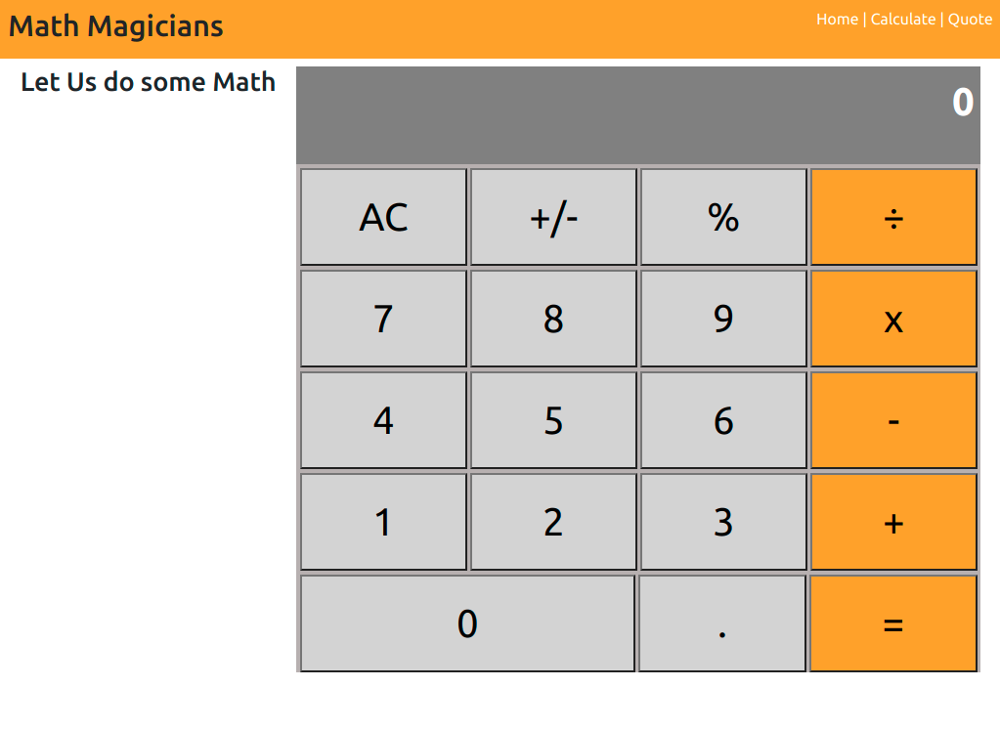
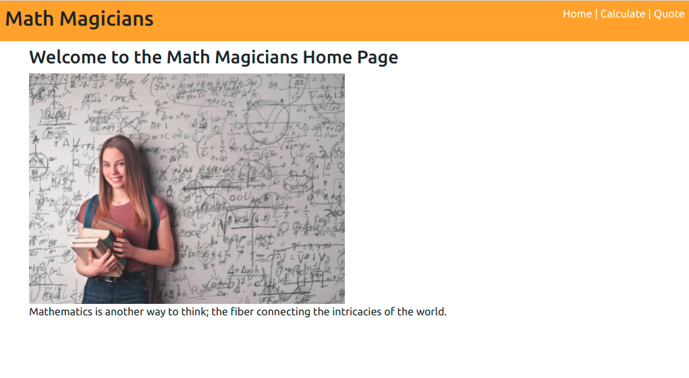

# math-magicians


> A React Calculator Application for Math Magicians Inc.

It has 3 pages, a Home, Calculate and Quote page. The navigation is linked using react-router-dom. The calculator app is mounted as a component on the Calculate page.

Logic is written to provide for calculations breaking the Calculator app into the components Display, ButtonPanel and Button for individual buttons. Event-handling is used when buttons are clicked to pass props to the App component that contains the calculate method with logic of how to deal with the various components.

### Calculate Page


## Live Demo
[Heroku link](https://marco-math-magicians.herokuapp.com/)

## Built With

- HTML5 & CSS3, & JavaScript
- ReactJS, react-router-dom

## Instructions
To get a local copy up and running follow these simple example steps.

### Prerequisites
- Gitbash installed to navigate between the branches.
- A preferred text editor for example VS Code.
- A browser such as Google Chrome

## Install
Clone this [GitHub Repo](https://github.com/KabohaJeanMark/math-magicians/) to your computer on yourFolder by typing these commands in the terminal or download as a Zip file and extract.
```
$ mkdir yourFolder
$ cd yourFolder
$ git clone https://github.com/KabohaJeanMark/math-magicians/

```

## How to Use
Navigate to the home page by default. You have a navigation menu to link to the rest of the pages, Calculate and Quote.

### Home Page


### Calculate Page


In this page, you can do calculations by typing into the Calculator and viewing the Displayed results.

### Quote Page


## Available Scripts

In the project directory, you can run:

### `npm start`

Runs the app in the development mode.\
Open [http://localhost:3000](http://localhost:3000) to view it in the browser.

The page will reload if you make edits.\
You will also see any lint errors in the console.

### `npm test`

Launches the test runner in the interactive watch mode.\
Unit tests for the different components have been done using jest and @testing-library/react

## Author

👤 **Kaboha Jean Mark**

- GitHub: [@KabohaJeanMark](https://github.com/KabohaJeanMark)
- Twitter: [@jean_quintus](https://twitter.com/jean_quintus)
- LinkedIn: [Jean Mark Kaboha](https://www.linkedin.com/in/jean-mark-kaboha-software-engineer/)


## 🤝 Contributing

Contributions, issues, and feature requests are welcome!

Feel free to check the [issues page](https://github.com/KabohaJeanMark/math-magicians/issues).

## Show your support

Give a ⭐️ if you like this project!

## Acknowledgments

- Hat tip to Microverse for the README template, instructions and tutoring for this Capstone project.

## 📝 License

This project is [MIT](./LICENSE) licensed.
