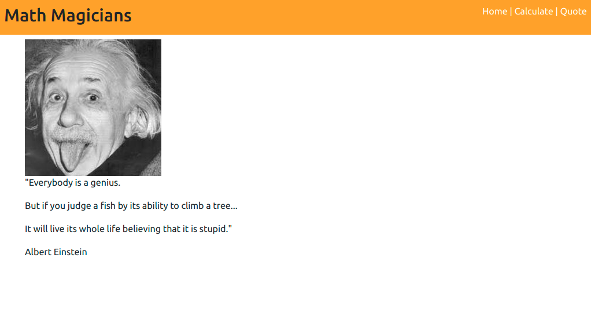

# math-magicians


> A React Calculator Application for Math Magicians Inc. Set up with create-react-app.
It has 3 pages, a Home, Calculate and Quote page. The navigation is linked using react-router-dom. 

### Calculate Page


## Live Demo
[Live site](https://marco-math-magicians.herokuapp.com/)

## Built With

- HTML5 & CSS3, & JavaScript
- ReactJS

## Instructions
To get a local copy up and running follow these simple example steps.

### Prerequisites
- Gitbash installed to navigate between the branches.
- A preferred text editor for example VS Code.
- A browser such as Google Chrome

## Install
Clone this [GitHub Repo](https://github.com/KabohaJeanMark/math-magicians/) to your computer on yourFolder by typing these commands in the terminal or download as a Zip file and extract.
```
$ mkdir yourFolder
$ cd yourFolder
$ git clone https://github.com/KabohaJeanMark/math-magicians/

```

## How to Use
Navigate to the home page by default. You have a navigation menu to link to the rest of the pages, Calculate and Quote.

### Home Page


### Calculate Page


In this page, you can do calculations by typing into the Calculator and viewing the Displayed results.

### Quote Page



## Available Scripts

In the project directory, you can run:

### `npm start`

Runs the app in the development mode.\
Open [http://localhost:3000](http://localhost:3000) to view it in the browser.

The page will reload if you make edits.\
You will also see any lint errors in the console.

### `npm test`

Launches the test runner in the interactive watch mode.\
See the section about [running tests](https://facebook.github.io/create-react-app/docs/running-tests) for more information.

### `npm run build`

Builds the app for production to the `build` folder.\
It correctly bundles React in production mode and optimizes the build for the best performance.

The build is minified and the filenames include the hashes.\
Your app is ready to be deployed!

See the section about [deployment](https://facebook.github.io/create-react-app/docs/deployment) for more information.

## Author

👤 **Kaboha Jean Mark**

- GitHub: [@KabohaJeanMark](https://github.com/KabohaJeanMark)
- Twitter: [@jean_quintus](https://twitter.com/jean_quintus)
- LinkedIn: [Jean Mark Kaboha](https://www.linkedin.com/in/jean-mark-kaboha-software-engineer/)


## 🤝 Contributing

Contributions, issues, and feature requests are welcome!

Feel free to check the [issues page](https://github.com/KabohaJeanMark/math-magicians/issues).

## Show your support

Give a ⭐️ if you like this project!

## Acknowledgments

- Hat tip to Microverse for the README template, instructions and tutoring for this Capstone project.

## 📝 License

This project is [MIT](./LICENSE) licensed.
